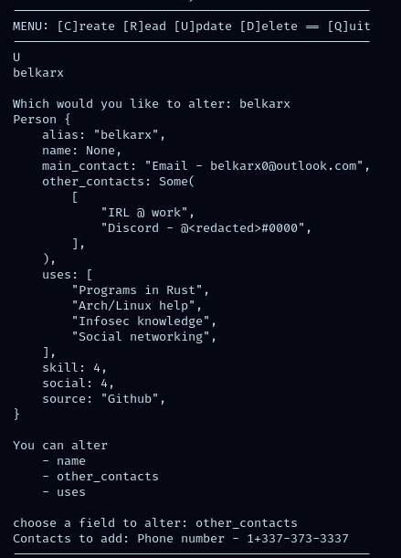

# Rust CRM

## Functionality
This application allows for management of connections and is intended for keeping track of random strangers found online. 

Each contact is stored as a json object, and data is stored in `data.json` and accessed as a `HashMap`

#### Sample Use



The interface exposes `[C]reate`, `[R]ead`, `[U]pdate`, and `[D]elete`, with plans to support sorting by source location and technical skill.

## Setup
Download from [here](https://github.com/belkarx/rust-hrm/releases/download/v0.0.0-alph/hrm) and `./hrm`

#### Or build it yourself
```bash
git clone --depth 1 https://github.com/belkarx/rust-hrm.git
nvim hrm/src/main.rs #change the DATA_PATH variable if you wish
cargo build --release
./target/release/hrm 
```

## TODO
* Add clearer instructions
* Add wayy better error-recovery
* Add a TUI (Cursive)
* Add sorting functionality
